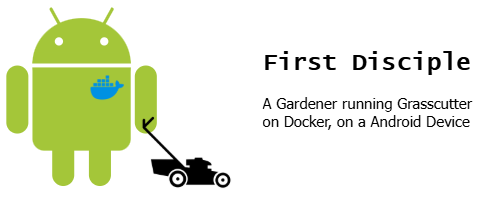
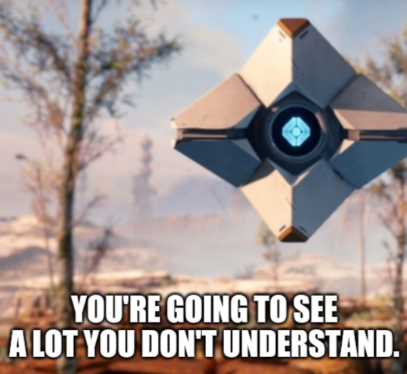

# Background Story

> TL;DR: As a gamer, I want to see if I can play platform-exclusive online-only games whenever & wherever I want, as long as my phone battery have not reach 0%.

## Pouring money into the sea

I liked an online FPS looter-shooter before, and I spent a lot of time on it, even buying and upgrading my computer. Then I witnessed it becoming another ugly money-bragging monster just like every other online games did ("You either die a hero, or live long enough to see yourself become the villain", huh?). I have no choice but to leave the game before it become unbearable. Even worse, the company have deleted the campaign warfares and maps of first 3 years. As the game is online-only, I, as a player and consumer, could no longer access the content even I have paid for them.

## The need for a Window in Android

A few months ago before initialization of this project, one of my friends asked if one can play a Windows-exclusive card game on phone (in this case, an Android phone). While it is technically feasible, I did not try that solution as I did not have the capacity to work on it at that time.

I read [an article](https://blog.kronis.dev/blog/stop-killing-games) about the recent "Stop Killing Games" movement. I noticed a project mentioned in the post, which allows players to play a certain [gacha game](## "Yes, you've guessed it, G****** I*****. (whisper) Gotta censor the name, you know.") locally with a private server. While the game is not dead yet (actually being very profitable now and in forseeable future), it does not stop players to build private servers like Minecraft.

## Why this is becoming a new project?

These leads me to think of a possibility: <b>running a Windows OS in Android to play whatever games we want</b>.  I mean, why not build the off-grid version on Android? After all, Android is Linux, which means Docker theoretically can work on it. Of course, trying to run a 100GB+ RPG would be reckless, but running some modded/lightweight/single-player games should be good to go. With improved performace of modern Smartphone, we can even run a tiny-scale server on it, right?

Some may question as the content creator Geekerwan have done [something similar](https://www.youtube.com/watch?v=nrvnpFCcZeA) already. The core difference is that Geekerwan replaced the base OS of a phone from Android to Windows (essentially created a Windows Phone, but with Android CPU), while what I want is to access like Windows <b>AND</b> retain the functionality of Android (more like a Hackintosh-enabled PC). 

## About the name of the project

The term "Disciple" is not only used for religious purpose, but also used in another game Destiny 2, where disciples refers to the subordinate of The Witness. The Witness itself (or themselves) is highly related to The Gardener in the Genesis (so-to-speak) of Destiny franchise. The end product of this project would be an Android device "running grasscutter (lawnmower)" which is part of a gardener's job. There is also an interesting relationship between "the gacha game" and Destiny 2 in terms of in-game elements (activities, abilities, the setting of Elemental weapons, etc.), so I named the project like so by instinct.

# Aim of the project
The long-term goal of this project is to work as a Proof-of-concept (POC) of running Windows games on Android, just like Samsung's DeX mode.

The scope of this project are:
- to create a Docker image (or a package) to run [Grasscutter](https://github.com/Grasscutters/Grasscutter) project and its launcher ([Cultivation](https://github.com/Grasscutters/Cultivation)) on any Linux system (including Android) without the need to connect main server
- to create a highly detailed documentation of any people looking for a solution

# Development Process
 
> [!WARNING]
> 

## 0 - Building a grasscutter in Windows VM 
(You can skip to Step 1 if you do not need this testing environment) 
Here, I follow the official steps and build a local grasscutter. In general, the steps are as follows:
1. Set the environment:
    <table>
        <tr>
            <th>Component</th>
            <th>Product</th>
            <th>Version</th>
        </tr>
        <tr>
            <td>OS</td>
            <td>Windows</td>
            <td>10 Home</td>
        </tr>
        <tr>
            <td>Java</td>
            <td>OpenJDK</td>
            <td>17</td>
        </tr>
        <tr>
            <td>Database</td>
            <td>MongoDB</td>
            <td>Community Version 8</td>
        </tr>
    </table>
2. Install by GUI
3. Build a service-chain:<ol>
        <li>Database (MongoDB)
        <li>Application (Grasscutter)
        <li>Proxy by Fiddler
        <li>Web (Cultivation) / other console
    </ol>

## 1 - Dockerized Grasscutter 
With the installation experience and knowing how to run that game, let's build a Docker version.

Theses are some core question in mind:
<ul><li>Can I reuse past projects? Why/ why not? What are the flaws that can only be fixed by upgrading?</li><li>Any feature must be presented in GUI?</li><li>Which step(s) could be automated in dockerfile?</li><li>Which component(s) could be in linux or service instead of installing on the Windows instance manually?</li></ul>

> [!NOTE]
> If you are compiling by yourself, please ensure your machine can access Internet. 

> TL;DR: The result is the [Dockerfile](./Dockerfile) and [docker-compose.yaml](./docker-compose.yaml)

1. The base model: This should support JDK 17, `eclipse-temurin:17-jdk-jammy` and `openjdk:17.0.2-slim` should work well.
2. The base workload (DB and APP components) would be on the Linux side.
3. The WEB part (console / client-side) should be on Windows.

### Best Practices in future
- [ ] ~~Try to avoid `git clone` as it will enlarge the image size~~
- [ ] The game files (even zipped) are so big, which should not be download directly in docker image. The workaround is to split into building stage and run stage

## 2 - Replicate the experience in Android
> Core Question in mind: <ol><li>Any limitation in Android's QEMU?</li></ul>

1. Install and Run Docker in Android: [Instruction](./docs/docker-on-android.md)
2. Download and run ... <i>To be completed later</i>

# How to use
As a "lazy guy package", here's how to replicate:
1. Get Docker on VM on Android
2. `git clone` this project and compose the dockerfile for image
3. Run docker compose
4. Run the server and have fun!

# Conclusion
<i>TBC</i>

<b>Feel free to star and fork this project!</b>

# Acknowledgements
## The "references" of this project:
- Game Server: [Grasscutter](https://github.com/Grasscutters/Grasscutter) 
- Game UI: [Cultivation](https://github.com/Grasscutters/Cultivation)
- All-in-one launcher: [Celestia Launcher](https://github.com/nullsora/CelestiaLauncher) [It was archived and now read-only] 
- The base OS to play on: [Dockur/Windows](https://github.com/dockur/windows)
- How to run Docker in Android <u>without root</u>: https://medium.com/@kumargaurav.pandey/docker-on-mobile-that-too-without-root-how-7b0848833c42 OR https://medium.com/android-tweaks/how-to-run-docker-on-android-80b9ad352f2d
- [GUI of Linux system in docker container](https://docs.linuxserver.io/images/docker-webtop)
- Some other past projects:
    - Github:
        - [gojuukaze/Grasscutter_Docker](https://github.com/gojuukaze/Grasscutter_Docker)
        - [ymjing/Dockerfile](https://gist.github.com/ymjing/1302bee87298480cab1bd712431d6247)
    - Docker:
        - [dezhao/grasscutter](https://hub.docker.com/r/dezhao/grasscutter)
        - [ayakalab/grasscutter](https://hub.docker.com/r/ayakalab/grasscutter)
        - [evendevil66/grasscutter](https://hub.docker.com/r/evendevil66/grasscutter)
        - [aliothzone/grasscutter](https://hub.docker.com/r/aliothzone/grasscutter)
        - [ayay2021/grasscutter](https://hub.docker.com/r/ayay2021/grasscutter)
        - [universonic/grasscutter](https://hub.docker.com/r/universonic/grasscutter)
    - Others:
        - https://yuanfangblog.xyz/technology/811.html
        - https://blog.csdn.net/qq_33889574/article/details/125145373

## Image used:
- https://www.reddit.com/r/destiny2/comments/u0euh1/the_first_words_you_hear_from_the_ghost/

# Disclaimer
<i>
    This project is not affiliated, sponsored, or endorsed by any corporation.
    This project is non-profit and only works for testing and developing purposes.
     
    Use at your own risks. The author of this project shall not be liable to any loss in any form, nor any legal issues raised by the origin enterprise.
</i>