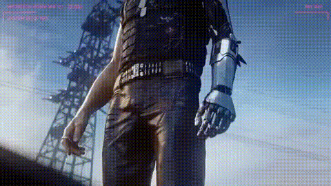

# First Disciple: Grasscutter in Docker

## Background Story

> TL;DR: As a gamer, I want to see if I can play platform-exclusive online-only games whenever & wherever I want, as long as my phone battery have not reach 0%.

I liked an online FPS looter-shooter before, and I spent a lot of time on it, even buying and upgrading my computer. Then I witnessed it becoming another ugly money-bragging monster just like every other online games did ("You either die a hero, or live long enough to see yourself become the villain", huh?). I have no choice but to leave the game before it become unbearable. Even worse, the company have deleted the campaign warfares and maps of first 3 years. As the game is online-only, I, as a player and consumer, could no longer access the content even I have paid for them.

A few months ago before initialization of this project, one of my friends asked if one can play a Windows-exclusive card game on phone (in this case, an Android phone). While it is technically feasible, I did not try that solution as I did not have the capacity to work on it at that time.

I just read [an article](https://blog.kronis.dev/blog/stop-killing-games) about the recent "Stop Killing Games" movement. I noticed a project mentioned in the post, which allows players to play a certain [gacha game](## "Yes, you've guessed it, G****** ") locally without the risk of server getting shut down or access getting blocked. While the game is not dead yet (actually being very profitable now and in near future), it does not stop players to build private servers like Minecraft.

These leads me to think of a possibility: <b>running a Windows OS in Android to play whatever games we want</b>. I mean, why not build the off-grid version on Android? After all, Android is Linux, which means Docker theoretically can work on it. Of course, trying to run a 100GB+ RPG would be reckless, but running some modded/lightweight/single-player games should be good to go. Some may question as Geekerwan have done [something similar](https://www.youtube.com/watch?v=nrvnpFCcZeA) already. The core difference is that Geekerwan replaced the base OS of a phone from Android to Windows (essentially created a Windows Phone), while what I want is to access like Windows and retain the functionality of Android (more like a Hackintosh-enabled PC). 

## Aim of the project
The long-term goal of this project is to work as a Proof-of-concept (POC) of running Windows games on Android, just like Samsung's DeX mode.

The scope of this project is to create a Docker image (or a package) to run [Grasscutter](https://github.com/Grasscutters/Grasscutter) project and its launcher ([Cultivation](https://github.com/Grasscutters/Cultivation)) on any Linux system (including Android) without the need to connect main server.

## Procedures
### 0 - Building a grasscutter in Windows VM 
(You can skip to Step 1 if you do not need this testing environment)
Here, I follow the official steps and build a local grasscutter first:
1. Set the environment:
    <table>
        <tr>
            <th>Component</th>
            <th>Product</th>
            <th>Version</th>
        </tr>
        <tr>
            <td>OS</td>
            <td>Windows</td>
            <td>10 Home</td>
        </tr>
        <tr>
            <td>Java</td>
            <td>OpenJDK</td>
            <td>17</td>
        </tr>
        <tr>
            <td>Database</td>
            <td>MongoDB</td>
            <td>Community Version 8</td>
        </tr>
    </table>
2. Install by GUI
3. Build a service-chain:<ol>
        <li>Database (MongoDB)
        <li>Application (Grasscutter)
        <li>Web (Cultivation) / other console
    </ol>

### 1 - Dockerized Grasscutter 
With the installation experience and knowing how to run that game, let's build a Docker version:
> Core Question in mind:<ul><li>Any feature must be presented in GUI?</li><li>Which step(s) could be automated in dockerfile?</li><li>Which component(s) could be in linux or service instead of installing on the Windows instance?</li><li>Which step(s) and conponent(s) could be replaced in shell script language?</li></ul>

1. 

### 2 - Packaging as a docker-compose.yaml / Docker image
> Core Question in mind: <ol><li></li></ul>

<b>TBC</b>

### 3 - Replicate the experience in Android
> Core Question in mind: <ol><li></li></ul>

<b>TBD</b>

1. Install and Run Docker in Android: [Instruction](./docker-on-android.md)
2. Download and run 

## Conclusion
<b>TBC</b>

## Acknowledgements
### The "references" of this project:
- Game Server: [Grasscutter](https://github.com/Grasscutters/Grasscutter) 
- Game UI: [Cultivation](https://github.com/Grasscutters/Cultivation)
- All-in-one launcher: [Celestia Launcher](https://github.com/nullsora/CelestiaLauncher) [It was archived and now read-only] 
- The base OS to play on: [Dockur/Windows](https://github.com/dockur/windows)
- How to run Docker in Android <u>without root</u>: https://medium.com/@kumargaurav.pandey/docker-on-mobile-that-too-without-root-how-7b0848833c42 OR https://medium.com/android-tweaks/how-to-run-docker-on-android-80b9ad352f2d
- [GUI of Linux system in docker container](https://docs.linuxserver.io/images/docker-webtop)

### Image used:
- 
- 
- 

## Disclaimer
<i>
    This project is not affiliated, sponsored, or endorsed by any corporation.
    This project is non-profit and only works for testing and developing purposes.
     
    Use at your own risks. The author of this project shall not be liable to any loss in any form, nor any legal issues raised by the origin enterprise.
</i>